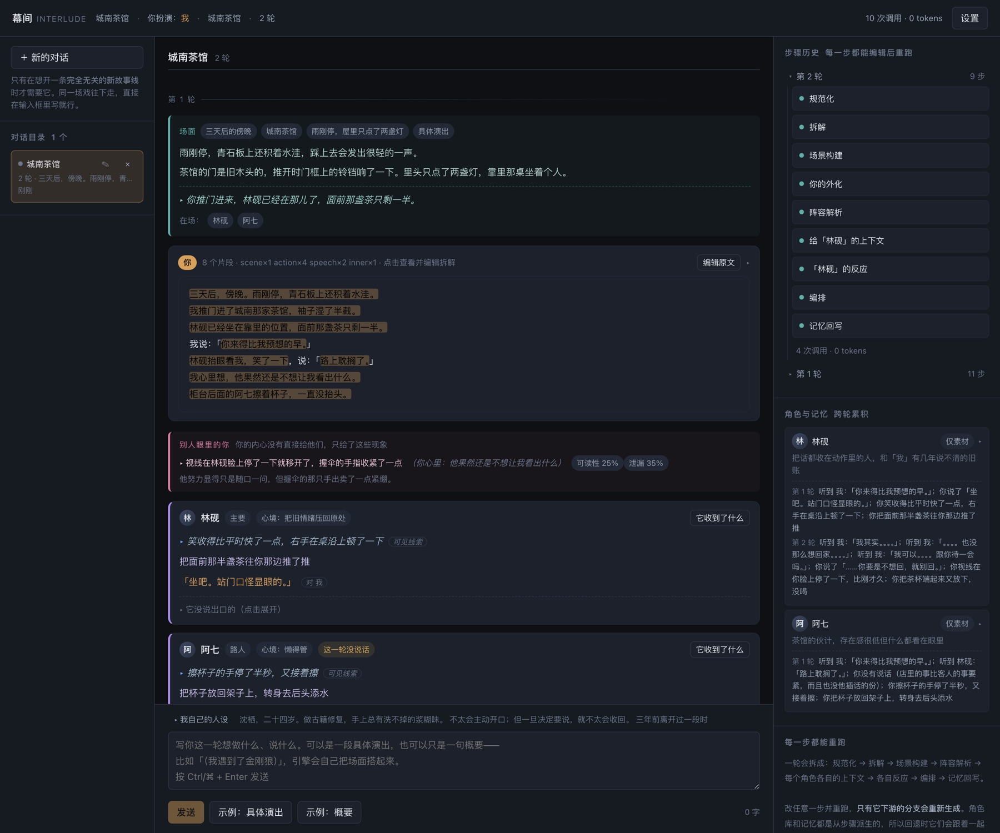
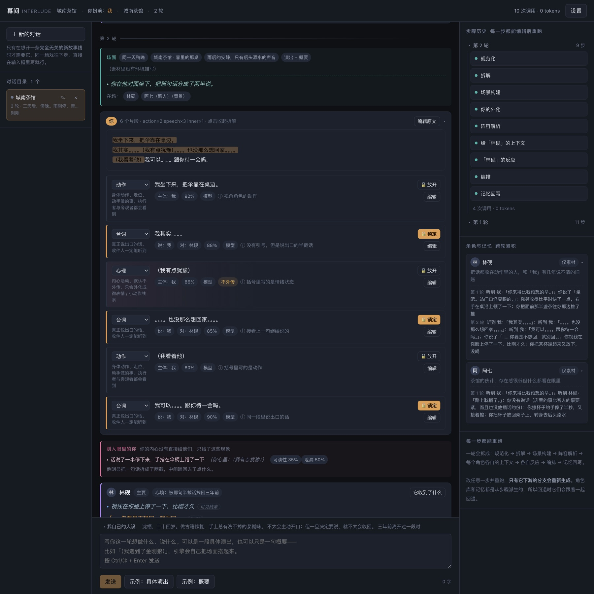
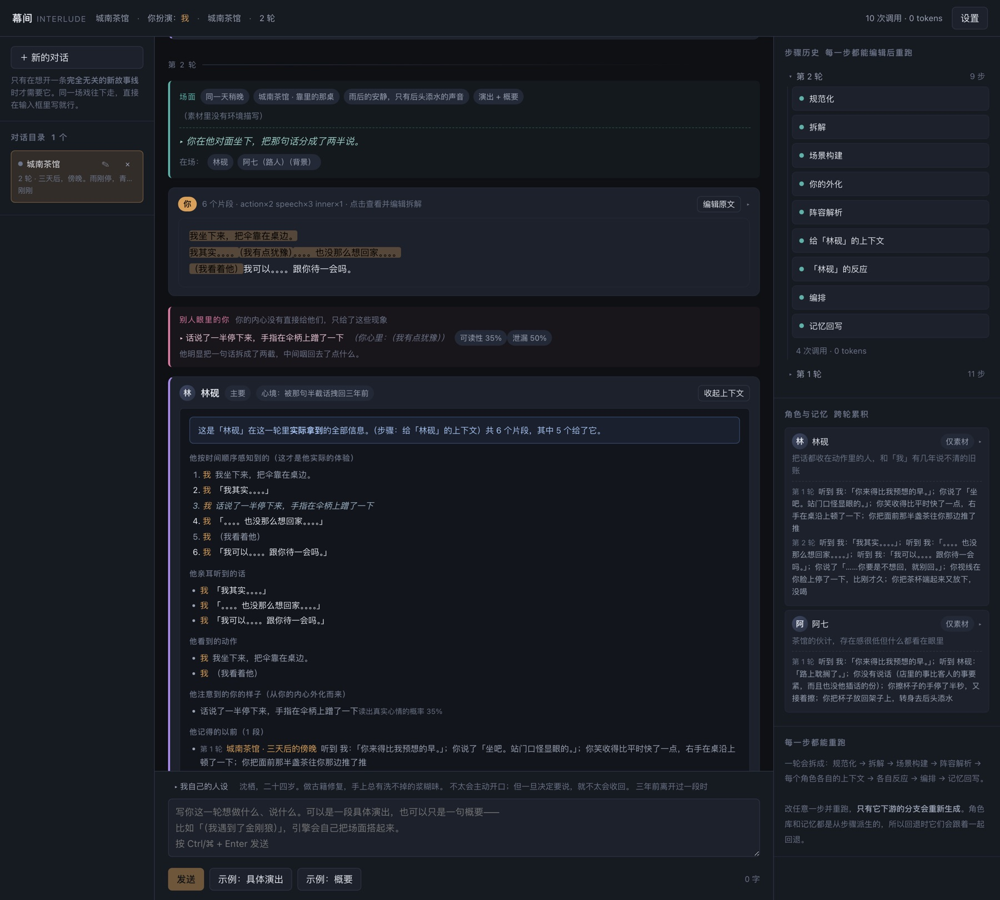

# 幕间 Interlude

**你写一句剧情，剩下的交给引擎。**

它会把你写的东西拆开、搭起场面、派发给场上每个角色，让他们各自反应，再按时间顺序把这一幕接进故事线。



---

## 它和酒馆（SillyTavern）有什么不一样

两者都是自托管的角色扮演前端，都用自己的 API Key，都能导入自己喜欢的模型。区别在于**「谁来决定该发生什么」**。

酒馆把决定权交给你：你写一条消息，AI 回一条，你看着不对就改提示词、调采样参数、上正则。它是一台**非常好用的单角色对话机器**。

幕间想做的事不一样：**你只负责写剧情，引擎负责调度。** 你把一段素材丢进去，它自己判断这段里哪些是台词、哪些是动作、哪些是场景、哪些是没说出口的；判断谁在场；给每个人一份只属于他的上下文；然后让所有人**同时**反应。

| | 酒馆 | 幕间 |
|---|---|---|
| **一次输入** | 一条消息 = 一次生成 | 一段素材 = 一整轮，场上所有角色**并发**反应 |
| **你说的话** | 就是消息本身 | 先被拆解成片段，你说出口的话会被**锁定**，AI 一字不能改 |
| **心理描写** | 直接写出来，所有人都看得见 | 不外传。结合你写的人设，只把「看得见的痕迹」给对方 |
| **信息差** | 上下文全员共享 | 每个角色一份**私有上下文**，含一份「你确定不知道的事」 |
| **配角** | 要自己建卡 | 自动生成；再出场时**复用**同一张卡，人设不漂 |
| **看到了什么** | 只能看最终输出 | 点开任意角色，能看到它这一轮**实际拿到了什么** |
| **改坏了怎么办** | 删消息重来 | 任意一步可编辑，**只重跑受影响的那条分支** |
| **结构** | 一条聊天记录 | 「对话」（可切换的故事线）＋ 线性轮次 |
| **设置项** | 一大堆 sampler、预设、正则 | 只有三个开关 |

还有一条最不一样的：**你在幕间里说的话，AI 改不了。** 酒馆里你打的内容通常只是"给 AI 看的输入"，而在幕间里它是一份要照着演的剧本——你说出口的台词会原样出现在舞台上，AI 只能补动作、微表情和它自己的话。

**酒馆更适合**：想精细控制每一次生成、依赖世界书（Lorebook）和正则、习惯自己调教提示词。
**幕间更适合**：不想管这些，只想写剧情，然后看一群人自己动起来。

---

## 心理描写不会被别人读到，但它会「外化」

这是幕间最核心的一条规则。

你写：

```
我其实。。。。（我有点犹豫）。。。。也没那么想回家。。。。
```

引擎**不会**把「我有点犹豫」发给任何角色。它结合你的人设判断：这种犹豫在你身上会留下什么**看得见的痕迹**——

> 话说了一半停下来，手指在伞柄上蹭了一下

角色拿到的是这句话，而不是你的心里话。而且这行字还带着两个数：

- **可读性 35%** — 对方把这条线索读成「他在犹豫」的概率
- **泄漏 50%** — 你这个人在人设上有多藏不住事

人设里写了"城府很深、习惯控制表情"，泄漏就会压到 10~20%；写了"藏不住事"，就会到 70~80%。如果人设就是能完全压住，它也可以**一点都不露**。



---

## 点开任意角色，看它到底收到了什么

这是幕间区别于普通角色扮演的地方：**没有黑箱**。

点角色卡上的「它收到了什么」，你会看到它这一轮拿到的全部信息，按时间顺序排列：

```
1. 你说：「我其实。。。。」
2. 你注意到「我」：话说了一半停下来，手指在伞柄上蹭了一下
3. 你说：「。。。。也没那么想回家。。。。」
4. 你看我
5. 你说：「我可以。。。。跟你待一会吗。」
```

**注意这是「依次发生」的，不是「并列发生」的。** 你说一句、停一下、再说一句——角色感知到的就是这个顺序，而不是一张"他说了什么 / 他做了什么"的分类清单。

再往下还有：他听到的话、他看到的动作、他注意到你的样子、**他记得的以前**，以及一份写明白的「**他确定不知道的事**」。



---

## 角色会记得上一轮

同一个角色再次出场，他会带着前面几轮的记忆上场——他听到的、他说过的、他当时心里想的。所以他能跟你叙旧、记仇、追问，而不是每轮重新认识你。

而且这份记忆是**他自己视角的版本**，不是全知剧本：你在他背后做的事，他不会记得。

角色卡也是跨轮复用的。你不用担心他在第二场戏里突然换了个人——引擎会直接用回第一次建的那张卡。

---

## 提到知名角色时，它的性格不会写成套话

你在素材里写「（我遇到了金刚狼）」，引擎会：

1. **判断你写的是演出还是概要**。只有一句概要也没关系，它会自己补出时间、地点、氛围、开场画面，以及场上还有谁（包括顺手加的一两个路人）。
2. **给新出场的角色查资料**（中英文维基百科，免 Key，3 秒超时，网络不通就跳过）。
3. 查到了就按资料写卡；查不到但你认识，就用模型自己的知识写——但提示词里明令禁止写「沉默寡言，性格坚毅」这种放在一百个角色身上都成立的废话：

```
✗「实力强大，深藏不露」
✓「动手前习惯先活动一下脖子」
✓「被问到过去时会直接换话题」
✓「嘴上嫌麻烦，但答应过的事一定做到」
```

这类角色还必须填满四项：标志性特征、示例台词、原作里确定的事实、**绝不会做的事**。最后一项专门用来防出戏。

---

## 装起来

```bash
git clone <这个仓库>
cd interlude
npm install
npm run dev
```

打开 http://127.0.0.1:5273/ ，右上角「设置」填上模型接口即可。

任何 **OpenAI 兼容**的接口都能用：DeepSeek、OpenAI、Kimi、Ollama、各种中转站。

| 字段 | 例子 |
|---|---|
| baseUrl | `https://api.deepseek.com/v1` |
| model | `deepseek-chat` |
| apiKey | `sk-...` |

Key 只存在你自己浏览器的 localStorage 里，不会发给任何第三方。

**想先看看长什么样？** 不用配 Key，直接打开：

```
http://127.0.0.1:5273/?demo=1
```

这是内置的演示模式——它会用一份脚本化的模型响应，**在浏览器里真的跑一遍完整流水线**，所以看到的内容都是真实产物，不是假数据。（刷新即可回到你自己的数据。）

---

## 用起来

1. **先写「我自己的人设」**（输入框上方，默认折叠）。你是谁、什么性格、此刻什么状态。它会注入拆解、场景构建和每个角色的判断。
2. **在底部输入框写这一轮。** 具体演出或者一句概要都行：
   - `我说：「你来得比我预想的早。」`
   - `（我遇到了金刚狼）`
3. **点「发送」。** 新的一轮接在下面，视图自动滑过去。
4. **想改？** 两种：
   - 点「你的输入」块右上角的 **「编辑原文」**，整段重写后重新生成
   - 鼠标移到那一轮的分隔线上，点 **「从这一轮重演」**（原文不变，只是重来一次）

   两种都会丢弃后面的轮次——时间线是线性的。不过没有确认弹窗，顶栏给了 **「↶ 撤销」** 兜底。
5. **想开一条完全无关的新故事线**，用左栏的「＋ 新的对话」。它是真的全新：角色库、记忆、上一幕的场景全部按对话隔离，在新故事里提到「林砚」，引擎不会认出上一场的那个林砚。

---

## 三个关键机制

**① 你的台词被锁定。** 你写出口的话原样出现在舞台上，AI 只能补动作和微表情。

**② 信息隔离是硬约束。** 每个角色的上下文里有一份「你确定不知道的事」，别人的内心永远不会进去。所以角色只能靠表情、语气、动作去猜——而且**允许猜错**。

**③ 每一步都能回退，而且只重跑受影响的分支。**

```
规范化 → 拆解 → 场景构建 → 阵容解析 ─┬─ 给A的上下文 → A的反应 ─┐
                                     ├─ 给B的上下文 → B的反应 ─┼→ 编排 → 记忆回写
                                     └─ 给C的上下文 → C的反应 ─┘
```

改「给 B 的上下文」，只有 B 的反应和编排会重算，A 和 C 原样复用。否则既费钱，角色表现还会漂。

---

## 目前还没有的

- **时间轴**：「三天后」目前只作为文字被场景构建读到，不会真的推进时钟，也不会自动补全这三天发生了什么。
- **多角色交错**：编排目前是确定性的顺序（场面 → 你的内容 → 角色反应），还没有"谁先开口、谁被打断"这类交错。
- **逐观察者的误读**：线索带了"可读性"，但还没有为每个角色单独算出他具体读成了什么。
- **世界书 / 正则 / 预设**：酒馆的这些幕间都还没有，也不打算原样照搬。
- **真实网络环境下的端到端验证**：开发时用的是一份脚本化的模型响应，各种中转站的兼容性还需要你帮忙试。

---

## 想更深入了解

设计文档在 [`docs/DESIGN.md`](docs/DESIGN.md)，里面有完整的数据结构、流水线设计、以及每一轮迭代的来龙去脉。

想参与开发的话：

```bash
npm run typecheck   # tsc --noEmit
npm test            # vitest，84 个用例
npm run build       # 类型检查 + 生产构建
```
